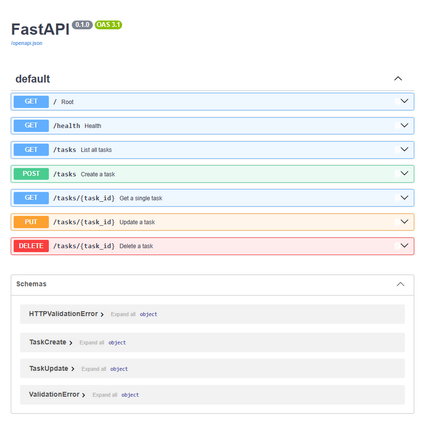
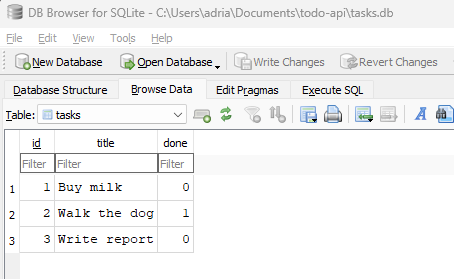

# Task API

A small CRUD API for managing a to-do list, built with FastAPI. Data is stored in memory (resets on restart).

## How to run

```bash
python -m venv venv
venv\Scripts\activate
pip install fastapi "uvicorn[standard]"
uvicorn main:app --reload --port 8000
```

Server runs at `http://localhost:8000`. Interactive docs at `http://localhost:8000/docs`.

## Endpoints

| Method | Path            | Description              |
|--------|-----------------|---------------------------|
| GET    | /               | API info                  |
| GET    | /health         | Health check               |
| GET    | /tasks          | List all tasks             |
| GET    | /tasks/{id}     | Get a single task          |
| POST   | /tasks          | Create a task              |
| PUT    | /tasks/{id}     | Update a task              |
| DELETE | /tasks/{id}     | Delete a task               |

## Example request

```
HTTP/1.1 201 Created
date: Fri, 28 Aug 2026 11:01:56 GMT
server: uvicorn
content-length: 40
content-type: application/json
{"id":4,"title":"Buy milk","done":false}
```

## Swagger UI



## Database

This project uses SQLite (`tasks.db`) for storage instead of an in-memory list.

**Why SQLite:** zero setup (no server to install or run), the whole database is a single file, and data survives restarts — ideal for a small project like this.

**Database file:** `tasks.db` is created automatically on first run and is git-ignored, so each fresh clone starts with a clean seeded database.

**Run the project:**
\`\`\`bash
uvicorn main:app --reload --port 8000
\`\`\`

**Sample SQL query (run in DB Browser, Stage 4):**
\`\`\`sql
DELETE FROM tasks WHERE done = 1;
\`\`\`
After marking all tasks done, this deleted all 5 rows, leaving the table empty — confirmed the API reflected the change instantly with no restart needed.

